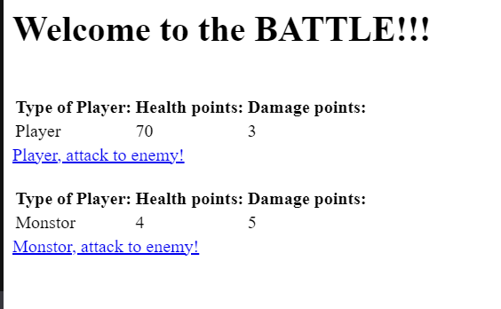
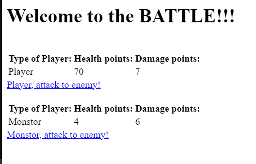

В задании не сказано, каким образом должно быть реализовано приложение, поэтому я его написал с применением Spring для визуализации.

Пример:

При переходе на http://localhost:8090/ нас встречает таблица из показателей игрока и монстра

Нам предоставляется выбор: кто атакует.

При нажатии на ссылку происходит битва, в результате которой либо нанесется урон противнику, либо нет.

В любом случае значения наносимого урона изменятся из созданного с помощью функции Random() диапазона значения при создании героя (Создание происходит при первоначальном заходе по http://localhost:8090/, далее при смерти героя).

О наборе в школу я узнал только сегодня, так что на решение тестового задания у меня был всего день, но так как оно простое, то грех жаловятся.
